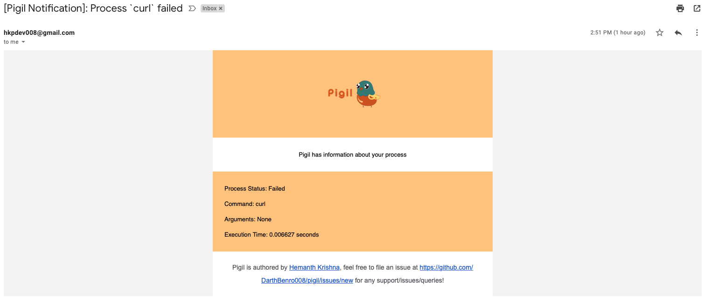
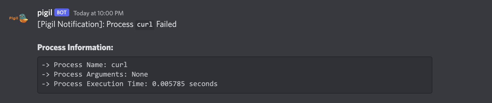

[](https://github.com/DarthBenro008/pigil/blob/master/LICENSE)
[](https://github.com/DarthBenro008/pigil/issues/new/choose)

# Pigil

> A process vigilance system written in GoLang

## 🤔 What is Pigil?

Pigil (Process vIGILance) is a self-hosted process watcher, that notifies you as soon as your process fails via an e-mail. It also maintains a record of all your commands for easier tracking.

Pigil keeps an eye on your processes when you have huge, time-taking builds and sends a notification via E-mail if the process fails to avoid any lapses in efficiency.

## 💻 Usage

Pigil currently has the following commands:

1. Install Pigil
2. Setup atleast one of the following notification channels:
   1. [Gmail Notifications](https://github.com/DarthBenro008/pigil/wiki/Setting-up-Gmail-Channel)
   2. [Discord Notifications](https://github.com/DarthBenro008/pigil/wiki/Setting-up-Discord-notification-channel)
3. Run any command just prefix pigil
   ```bash
    pigil <your command> # eg: pigil echo "This command is watched by pigil"
   ```
4. Any failure in the command will trigger an email notification on all your devices

### Pigil Commands

1. **`pigil <command>`**: will run the command and notify on failure
2. **`pigil bumf auth`**: will produce an authentication url
3. **`pigil bumf channels`**: setup channels of notification like discord/email
4. **`pigil bumf discord`**: Enable/Disable discord webhook
5. **`pigil bumf db`**: shows you the history of commands with thier execution time
6. **`pigil bumf status`**: shows current configurations
7. **`pigil bumf logout`** : Will log you out of your gmail account

## ⬇ Installation

### Using Homebrew

```bash
brew tap DarthBenro008/pigil
brew install pigil
```

### Using NPM

```bash
npm install -g pigil
```

### Using Yarn

```bash
yarn global add pigil
```

### Building from source

1. Create a GCP Project
2. Get `GOOGLE_CLIENT_ID` and `GOOGLE_CLIENT_SECRET` by creating an Oauth Client from GCP Console
3. Clone the project using the command `git clone https://github.com/DarthBenro008/pigil`
4. Create a file named `secrets.txt` in the root of the project
5. Paste your `GOOGLE_CLIENT_ID` and `GOOGLE_CLIENT_SECRET` seperated by space
6. Run the command `go build`
7. If you are on Linux/MacOS, make sure you move the binary to somewhere in your `$PATH` (e.g. `/usr/local/bin`).

### Manual Installation

You can also download the binary and install it manually.

- Go to [releases page](https://github.com/DarthBenro008/pigil/releases) and grab the latest release of gunfollower.
- Download the latest release of gunfollower specific to your OS.
- If you are on Linux/MacOS, make sure you move the binary to somewhere in your `$PATH` (e.g. `/usr/local/bin`).

## Sample Channel Notifications

### Sample Email Notification



### Sample Discord Notifiation



## 🤝 Contributions

- Feel Free to Open a PR/Issue for any feature or bug(s).
- Make sure you follow the [community guidelines](https://docs.github.com/en/github/site-policy/github-community-guidelines).
- Feel free to open an issue to ask a question/discuss anything about pigil.
- Have a feature request? Open an Issue!

### 📢 Shoutouts

Shoutout to [Khyati Gupta](https://www.behance.net/khyatigupta267) for amazing logo and banner illustrations

## ⚖ License

Copyright 2022 Hemanth Krishna

Licensed under MIT License : https://opensource.org/licenses/MIT

<p align="center">Made with ❤ , two cups of coffee and some chaii</p>
